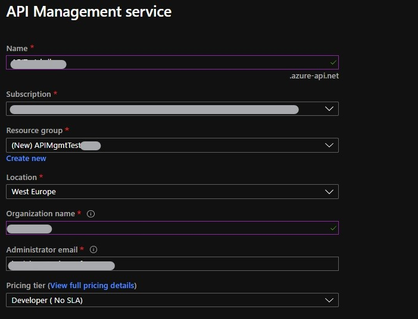
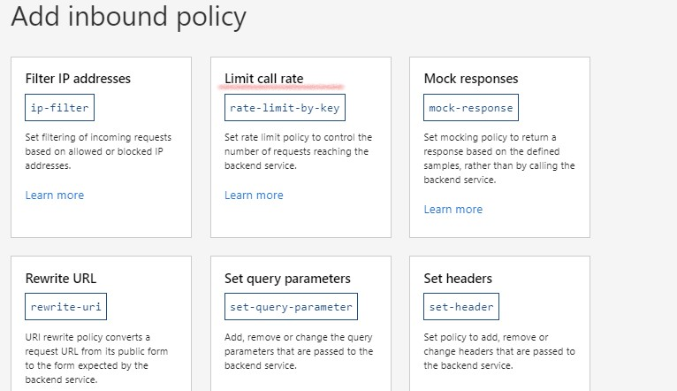
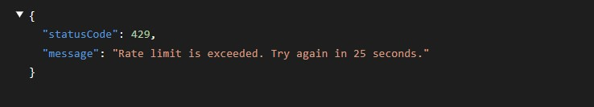

# Expose SAP oData Service via Azure API Management

<!--
    oData XMl Metadata : example_docs\EPM_REF_APPS_PROD_MAN_SRV.xml
    Initial File generated by OASIS tool : example_docs\EPM_REF_APPS_PROD_MAN_SRV.openapi3.json
    Final Result : see example_docs\finalEPM_REF_APPS_PROD_MAN_SRV.openapi3.json
-->

APIs are the digital building blocks used to build applications and build integrations between applications.
API Management helps organizations publish APIs to external, partner, and internal developers to unlock data and services. Businesses everywhere are looking to extend their operations as a digital platform, creating new channels, finding new customers and driving deeper engagement with existing ones.

In this article I will explain how to expose a SAP oData Service via Azure API Management. As SAP Backend implmenting the oData service I will make use of a 'ABAP Developer Edition' System. For more info see [AS ABAP 7.52 SP04, Developer Edition](https://blogs.sap.com/2019/10/01/as-abap-7.52-sp04-developer-edition-concise-installation-guide/). More specif, the sample oData Service is the `product` oData Service.
The service can be accessed via `http://<hostname>:<portname>/sap/opu/odata/sap/EPM_REF_APPS_PROD_MAN_SRV`.

This oData service exposes different entity sets:
- Products
- Suppliers
- ProductDrafts
- ...

A list of products can be retrieved via `http://<hostname>:<portname>/sap/opu/odata/sap/EPM_REF_APPS_PROD_MAN_SRV/Products`.
A specific product can be found using its productId, eg 'HT-1000' : `http://<hostname>:<portname>/sap/opu/odata/sap/EPM_REF_APPS_PROD_MAN_SRV/Products('HT-1001')`.

The `$metadata` of the service can be found at `http://<hostname>:<portname>/sap/opu/odata/sap/EPM_REF_APPS_PROD_MAN_SRV/$metadata`.

<!--
This article is based on the following tutorials :
- [Azure API Management : Import API from openAPI](https://docs.microsoft.com/en-us/azure/api-management/import-api-from-oas)
- [Create OpenAPI description from ABAP oData Service](https://blogs.sap.com/2019/07/09/how-to-create-an-openapi-rest-service-from-an-odata-v4-rest-service-with-sap-netweaver-abap/)
-->

## Create an Azure API Management Service
Azure API Management Service is the repository where the API will be registered. This is the fist Azure object which needs to be created. For a PoC the `Developer` tier is sufficient.



Now we need to register our oData service. There are different methods to create an API. 


The relevant options for a oData service are either to create it manually or upload the definition via an openAPI specification. So we need to convert the `$metadata` xml file to an openAPI specification. Luckily the internet offers tooling to execute this conversion.

### Download the oData $metadata
The `$metadata` can be downloaded from \
`http://<hostname>:<portname>/sap/opu/odata/sap/EPM_REF_APPS_PROD_MAN_SRV/$metadata`.

Save the result in a file, eg. `odata_sapnpl_description.xml`.

### Generate openAPI Description
To generate the openAPI specification, I will be using a tool from OASIS. You can find this tool on GitHub at [oData openAPI](https://github.com/oasis-tcs/odata-openapi)). This tool is based on nodeJS.

To install the tool, you first start by cloning the github repository.

```cmd
git clone https://github.com/oasis-tcs/odata-openapi.git
```

And sequentially downloading the NodeJS dependencies.`

```cmd
cd odata-openapi
npm install -g
```

The converter can be executed using the following command:

```cmd
odata-openapi3 --host <hostname>:<port> .\odata_sapnpl_description.xml
```
Use the `hostname`and `port`of your SAP oData service. 

This command will generate the openAPI description in a JSON document. Eg. `EPM_REF_APPS_PROD_MAN_SRV.openapi3.json`

>Note: The OASIS tool can only be used to convert ODATA 3.0 to openAPI. The SAP sample odata service is OData 2.0. I cheated a bit by changing this to oData 3.0 in the `$metadata` xml file.

```xml
<edmx:DataServices m:DataServiceVersion="3.0">
```

In the generated openAPI description, cross-check if the API server url points to the oData service.

```yaml
"servers": [
    {
      "url": "https://<hostname>:<portname>/sap/opu/odata/sap/EPM_REF_APPS_PROD_MAN_SRV"
    }
```

<!-- Security is added via API Management Policies so probably not needed
- add a security section./The SAP oData service requires authentication via userid and password. This needs to be reflected in the openAPI description.

In the components section :

```yaml
components :
    securitySchemes:
        basicAuth:
            type: http
            scheme: basic
```

At the end of the file, so it's used for the whole service.

```yaml
security:
    basicAuth: [basicAuth]
```
-->

You can edit this file online using an [online Swagger Editor](https://editor.swagger.io/) or using an openAPI/Swagger extension for Visual Studio Code.

### Import openAPI Description
The openAPI description can now be uploaded in the Azure API Service.

The oData service provides different entity sets with their `GET`, `POST` & `DELETE` methods. The API design tab will show these entity methods and entity sets.


## API Definition
The focus for the rest of the document will be on the `Products` entity set and more in particular on the GET Products method.

The design tab displays the input parameters. These are the typical oData parameters like `$top`, `$count`, ... for a `GetEntitySet` list.


The setting tab gives 'global' settings for all the methods. Here you can define a base URL and a URL suffic. The resulting base URL by which the API can be called is as follows :  

 ```http://<API Service Managemer Name>/<API URL suffix>```

This url is then mapped to the oData URL of the SAP System.

The product list can be retrieved using `http://<API Service Managemer Name>/<API URL suffix>/Products`.
>Note : Comparison with the original URL of the SAP oData Service : `http://<hostname>:<portname>/sap/opu/odata/sap/EPM_REF_APPS_PROD_MAN_SRV/Products`.


In this example I set the value for User Authentication to 'None'.


Since the SAP oData service expects a userId and password, this needs to be provisioned via the API Management tool. This is defined within the BackEnd Endpoint.


## Throttling
Policies are a powerful capability of the system that allow the publisher to change the behavior of the API through configuration. Policies are a collection of Statements that are executed sequentially on the request or response of an API. Popular Statements include format conversion from XML to JSON and call rate limiting to restrict the amount of incoming calls from a developer. Many more policies are available out of the box.
See [Policies in Azure API Management](https://docs.microsoft.com/en-us/azure/api-management/api-management-howto-policies).



This example assigns a rate limit policy ('Throttling') to the Get Products API. Eg. only 2 calls per 30 seconds from the same IP address.

```xml
<policies>
    <inbound>
        <base />
        <authentication-basic username="DEVELOPER" password="*******" />
        <rate-limit-by-key calls="2" renewal-period="30" counter-key="@(context.Request.IpAddress)" />
    </inbound>
....

```

When the url is called 2 times within the 30 seconds timeframe, the following error is generated :



## Testing
API Management allows you to test your API using the Test tab.


The resulting product list, contains a url to the specific products. These urls still point to the url of the SAP system itself in stead of linking to the API Management Service. This can be prevented by using the `Redirect Url Policy` during the Outbound Processing of the API.
The complete policy now looks as follows :

```xml
<policies>
    <inbound>
        <base />
        <authentication-basic username="DEVELOPER" password="*********" />
        <rate-limit-by-key calls="2" renewal-period="30" counter-key="@(context.Request.IpAddress)" />
    </inbound>
    <backend>
        <base />
    </backend>
    <outbound>
        <base />
        <redirect-content-urls />
    </outbound>
    <on-error>
        <base />
    </on-error>
</policies>
```

The response now looks like :


The URLs now point to the API Management Service entry point.

##
This article gave an overview on how to integrate a SAP oData Service within Azure API Management and how to apply a throttling policy.

## References
- [Azure API Management Documentation](https://docs.microsoft.com/en-us/azure/api-management/)
- [Azure API Management Terminology](https://docs.microsoft.com/en-us/azure/api-management/api-management-terminology)
- [Azure API Management : Import API from openAPI](https://docs.microsoft.com/en-us/azure/api-management/import-api-from-oas)
<!-- - [Create OpenAPI description from ABAP oData Service](https://blogs.sap.com/2019/07/09/how-to-create-an-openapi-rest-service-from-an-odata-v4-rest-service-with-sap-netweaver-abap/) -->
